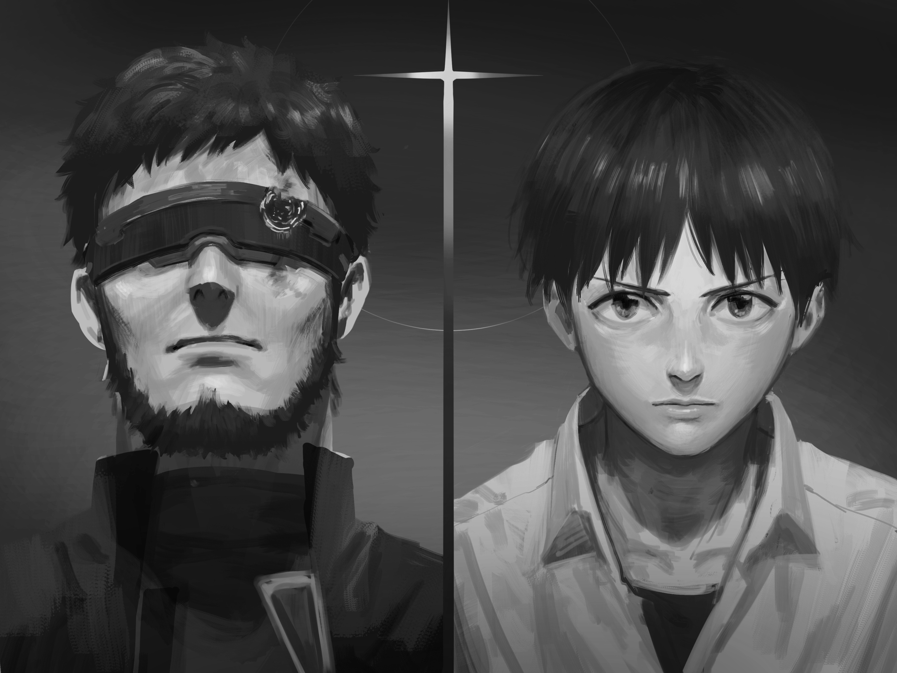
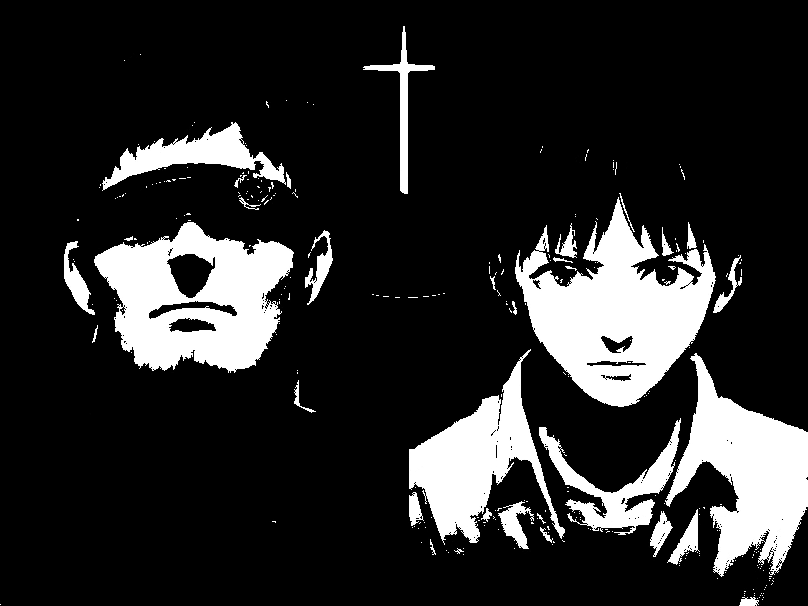

# Image Processing Exercise 1 - Report

Họ Tên: Võ Thành Nhân\
MSSV: 22200114

##

## Yêu cầu:

Đọc file ảnh màu, chuyển sang raw (raw.dat)
Viết chương trình C:

- chuyển sang gray scale (gray.dat)
- chuyển sang binary (bin.dat)

## Các bước thao tác

### 1. Chuyển đổi ảnh màu sang Raw format

```bash
python convert_dat.py
```

- **Input**: `input.jpg` (2912×2186 pixels)
- **Output**: `raw.dat`,`raw_info.txt` (thông tin chi tiết của ảnh đầu vào)

### 2. Chuyển đổi RGB sang Grayscale

```bash
g++ -o convert_gray convert_gray.cpp
./convert_gray
```

- **Input**: `raw.dat`
- **Output**: `gray.dat`
- **Công thức**: `0.299×R + 0.587×G + 0.114×B`

### 3. Chuyển đổi Grayscale sang Binary

```bash
g++ -o convert_bin convert_bin.cpp
./convert_bin
```

- **Input**: `gray.dat`
- **Output**: `bin.dat`
- **Ngưỡng**: < 128 = đen (0), ≥ 128 = trắng (255)

### 4. Xem kết quả

```bash
python open_image.py
```

- Tạo các file output: `raw_output.jpg`, `gray_output.jpg`, `bin_output.jpg`
- Hiển thị ảnh để kiểm tra kết quả

## Cấu trúc file

### Python Scripts

- `convert_dat.py` - Chuyển đổi ảnh màu sang raw format
- `open_image.py` - Mở và hiển thị các file .dat

### C Programs

- `convert_gray.cpp` - Chuyển đổi RGB sang grayscale
- `convert_bin.cpp` - Chuyển đổi grayscale sang binary
- `image_utils.h` - Header file chứa function prototypes
- `image_utils.c` - Implementation của utility functions

### Data Files

- `input.jpg` - Ảnh gốc
- `raw.dat` - Dữ liệu RGB thô
- `gray.dat` - Ảnh xám
- `bin.dat` - Ảnh nhị phân

## Cách chạy toàn bộ pipeline

```bash
# Bước 1: Chuyển đổi ảnh sang raw (tự động xác định kích thước ảnh)
python convert_dat.py

# Bước 2: Compile và chạy chương trình C (tự động đọc kích thước)
g++ -o convert_gray convert_gray.cpp
g++ -o convert_bin convert_bin.cpp

# Bước 3: Chuyển đổi RGB → Grayscale (auto-detect dimensions)
./convert_gray

# Bước 4: Chuyển đổi Grayscale → Binary
./convert_bin

# Bước 5: Xem kết quả (auto-detect dimensions)
python open_image.py
```

## Giải thích cấu trúc

- **RAW (raw.dat)**: Lưu toàn bộ pixel theo thứ tự dòng (row-major), mỗi pixel gồm 3 kênh RGB, mỗi kênh 1 byte (uint8). Kích thước dữ liệu: `width × height × 3` bytes.
- **Grayscale (gray.dat)**: Ảnh mức xám 1 kênh (1 byte/pixel). Giá trị xám được tính từ RGB theo công thức xấp xỉ độ chói (BT.709): `0.299×R + 0.587×G + 0.114×B`.
- **Binary (bin.dat)**: Ảnh nhị phân 1 kênh, áp ngưỡng tại 128: nhỏ hơn 128 → 0 (đen), ngược lại → 255 (trắng). Có thể thay đổi ngưỡng trong mã C.
- **image_config.txt**: Lưu `width` và `height` để các chương trình C/Python tự động đọc kích thước, không cần chỉnh tay trong code.
- **Đọc/ghi .dat**: Dữ liệu sắp xếp theo dòng, từ trái sang phải, từ trên xuống dưới. Với RGB: thứ tự kênh là R, G, B lặp lại theo từng pixel.

## Image_utils Module

### Mục đích

Module `image_utils` cung cấp các utility functions để đọc thông tin cấu hình ảnh, giúp các chương trình C tự động xác định kích thước ảnh.

### Cấu trúc

- **`image_utils.h`**: Header file chứa function prototypes và defines
- **`image_utils.c`**: Implementation của các utility functions

### Functions

- **`read_image_dimensions(int *width, int *height)`**:
  - Đọc kích thước ảnh từ file `image_config.txt`
  - Trả về 0 nếu thành công, 1 nếu lỗi
  - Tự động in thông báo kích thước đã xác định

### Sử dụng

```c
#include "image_utils.h"

int main() {
    int width, height;
    if (read_image_dimensions(&width, &height)) {
        printf("Failed to read dimensions\n");
        return 1;
    }
    // Sử dụng width, height...
}
```

## Hình ảnh minh họa

Input (gốc):


Grayscale:



Binary:


